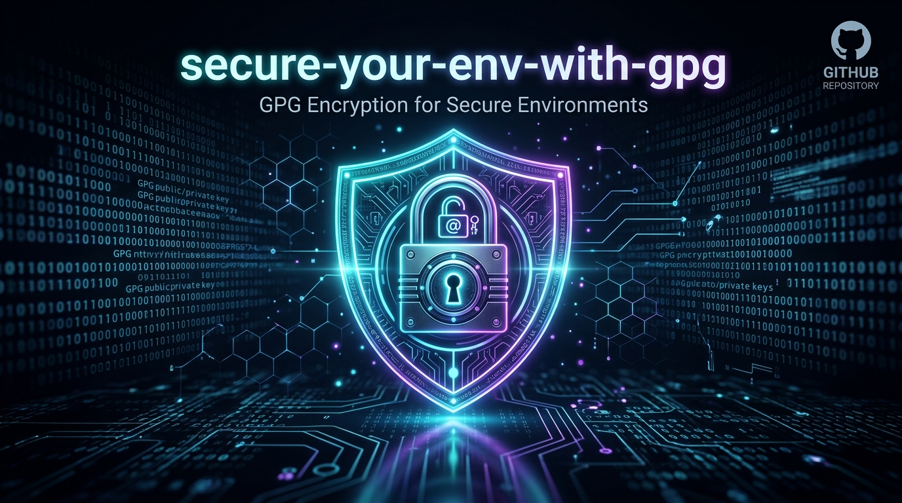

# secure-your-env-with-gpg



[](LICENSE)
[](https://github.com/Lalatenduswain/secure-your-env-with-gpg/stargazers)
[](https://github.com/Lalatenduswain/secure-your-env-with-gpg/pulls)

A zero-dependency, lightweight, and robust single-file Bash utility to easily encrypt and decrypt environment files (`.env`) using GPG. Features automated Git security hooks to prevent accidental plaintext leaks.

---

## Features

- 🔐 **GPG Encryption**: Supports both Symmetric (Passphrase) and Asymmetric (Key-based) GPG encryption.
- 🛑 **Plaintext Leak Protection**: Automatically configures `.gitignore` to prevent plaintext commits.
- 🪝 **Git Pre-commit Hook**: Intercepts commits if `.env` is staged or if `.env` has changes that haven't been encrypted.
- ⚙️ **CI/CD Friendly**: Easily decrypt environment variables inside GitHub Actions using Repository Secrets.

---

## Installation & Setup

1. Clone or download `secure-env.sh` into your project root:
   ```bash
   curl -fsSL https://raw.githubusercontent.com/Lalatenduswain/secure-your-env-with-gpg/main/secure-env.sh -o secure-env.sh
   chmod +x secure-env.sh
   ```

2. Initialize the Git safety hooks:
   ```bash
   ./secure-env.sh init-hooks
   ```

---

## Usage Guide

### 1. Symmetric Encryption (Passphrase)
Ideal for personal projects, simple key rotation, or sharing files with a shared password.

- **Encrypt**:
  ```bash
  ./secure-env.sh encrypt symmetric
  ```
  *This will prompt you for a password and create `.env.gpg`.*

- **Decrypt**:
  ```bash
  ./secure-env.sh decrypt symmetric
  ```
  *Restores the plaintext `.env` file.*

---

### 2. Asymmetric Encryption (GPG Key Pairs)
Ideal for teams or when committing secrets to a repository that multiple collaborators must decrypt using their own private keys.

- **Encrypt**:
  ```bash
  ./secure-env.sh encrypt asymmetric
  ```
  *This lists your public GPG keys, asks for the recipient, and generates the encrypted `.env.gpg`.*

- **Decrypt**:
  ```bash
  ./secure-env.sh decrypt asymmetric
  ```
  *Automatically decrypts using your private key.*

---

## GitHub Actions CI/CD Integration

To decrypt your `.env.gpg` file during your CI/CD pipelines:

1. **Symmetric mode**:
   - Store your passphrase in GitHub Secrets as `GPG_PASSPHRASE`.
   - In your `.github/workflows/ci.yml`:
     ```yaml
     - name: Decrypt environment variables
       env:
         GPG_PASSPHRASE: ${{ secrets.GPG_PASSPHRASE }}
       run: ./secure-env.sh decrypt symmetric
     ```

2. **Asymmetric mode**:
   - Export your GPG private key: `gpg --export-secret-keys --armor <KEY-ID>`
   - Store it as `GPG_PRIVATE_KEY` in GitHub Secrets.
   - Import the key and run decrypt in your workflow:
     ```yaml
     - name: Decrypt environment variables
       run: |
         echo "${{ secrets.GPG_PRIVATE_KEY }}" | gpg --import --batch
         ./secure-env.sh decrypt asymmetric
     ```

---

## License

This project is licensed under the MIT License - see the [LICENSE](LICENSE) file for details.
